<p align="center">
  
  
  
  
  
</p>

<h1 align="center">Water Rats Tracker</h1>

<p align="center">
  <strong>A full-stack session management & leader coordination platform for a Scouting water activities group.</strong>
  <br/>
  Built with React, TypeScript, Tailwind CSS, and Firebase — designed for real-world use by volunteer leaders.
</p>

<br/>

<p align="center">
  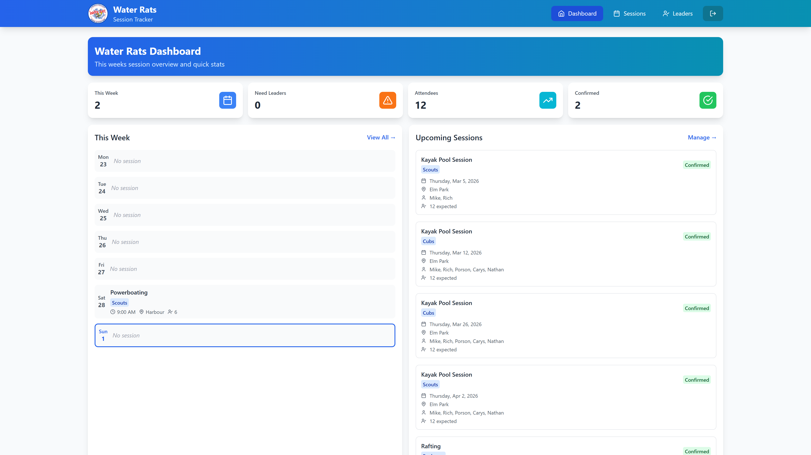
  <br/>
  <em>Dashboard — at-a-glance weekly overview with stat cards and upcoming sessions</em>
</p>

---

## 📋 Table of Contents

- [Overview](#-overview)
- [Features](#-features)
- [Pages & Screenshots](#-pages--screenshots)
- [Architecture](#-architecture)
- [Tech Stack](#-tech-stack)
- [Getting Started](#-getting-started)

---

## 🧭 Overview

**Water Rats** is a Scouting water activities group that runs sessions like paddleboarding, sailing, and kayaking across multiple age groups (Squirrels, Beavers, Cubs, Scouts, Explorers, and more).

This app was built to solve real coordination challenges:

| Problem | Solution |
|---|---|
| Leaders didn't know when sessions needed volunteers | Dashboard highlights understaffed sessions with visual alerts |
| Session details were scattered across messages & spreadsheets | Centralised session management with calendar, list, and spreadsheet views |
| No easy way to see who was qualified for what | Leader directory with qualifications, contact info, and session assignments |
| Volunteer interest forms required external tools | Built-in JSON-driven dynamic form system with a public registration page |

---

## ✨ Features

### 🏠 Smart Dashboard
Real-time statistics, a day-by-day weekly schedule, and an upcoming sessions feed — all in one view. Sessions needing leaders are flagged instantly.

### 📅 Three View Modes for Sessions
Switch between **List**, **Spreadsheet**, and **Calendar** views depending on your workflow. Inline editing in spreadsheet mode. Colour-coded calendar chips by status.

### 👥 Leader Management
A directory of leaders with qualifications (personal & scouting), contact info, and their upcoming session assignments — with visual badges for young leaders.

### 📝 Dynamic Form Engine
A JSON-driven form renderer that powers public-facing forms (like volunteer registration). Supports text, email, textarea, select, checkbox, and info block fields — all defined in a single JSON config file.

### 🔐 Custom Authentication
Shared-password login powered by a Firebase Cloud Function that validates credentials and issues a custom auth token — no email/password accounts needed.

### 🔔 Session Lifecycle
Full CRUD with status tracking (Planning → Confirmed → Completed / Cancelled), session duplication, leader sign-up/removal, and dirty-checking in modals to prevent accidental data loss.

---

## 📸 Pages & Screenshots

### Login

A clean, minimal login gate. Leaders enter a shared access password — authenticated via a Firebase Cloud Function that returns a custom token.


| Desktop View | Mobile View |
| :---: | :---: |
| 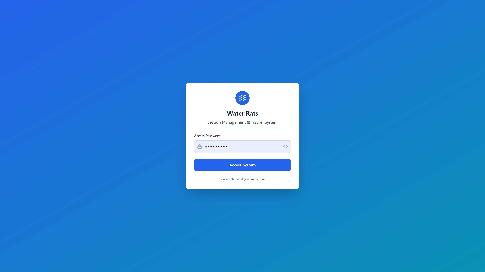 | 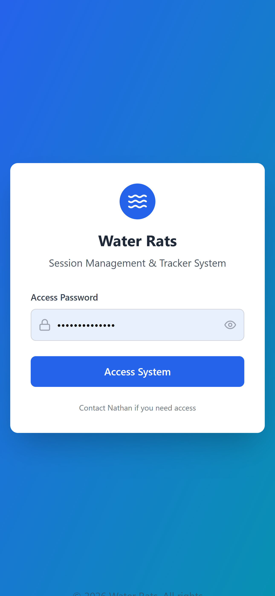 |

---

### Dashboard

At-a-glance overview with four stat cards (sessions this week, sessions needing leaders, total attendees, confirmed count), a Mon–Sun weekly schedule with today highlighted, and the next 5 upcoming sessions with status badges.

| Desktop View | Mobile View |
| :---: | :---: |
|  | 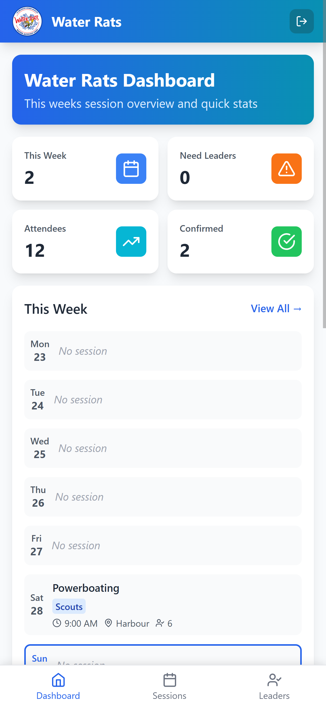 |


### Sessions — List View

Detailed session cards with activity name, group badge, clickable status badge, date/time, location, leader pills, and action buttons (copy, edit, delete). Sessions needing more leaders get an orange border and "NEEDED" badge.

| Desktop View | Mobile View |
| :---: | :---: |
| 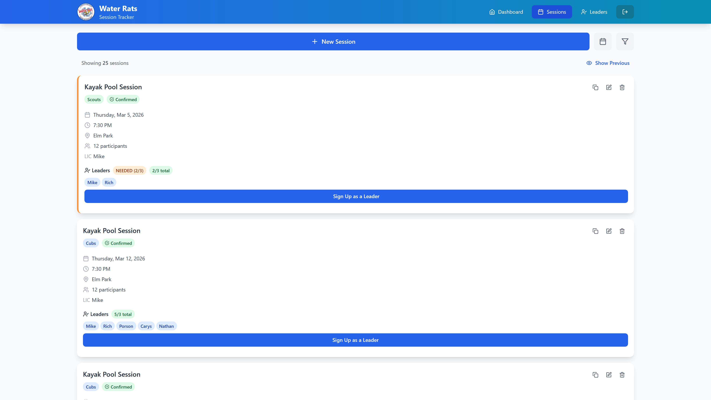 | 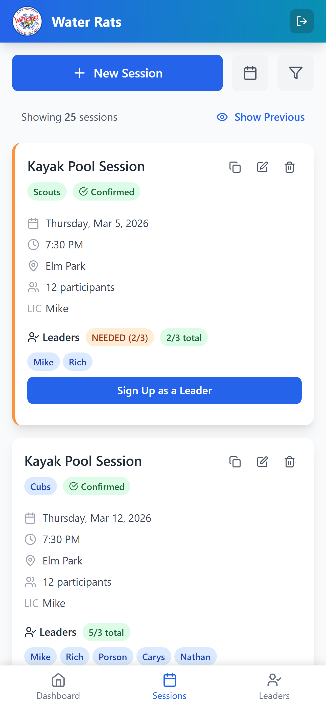 |

---

### Sessions — Spreadsheet View

A tabular view with inline editing — click any cell to edit activity, group, location, or attendees. Changes save on blur. Expandable notes rows and quick-access leader signup.

| Desktop View | Mobile View |
| :---: | :---: |
| 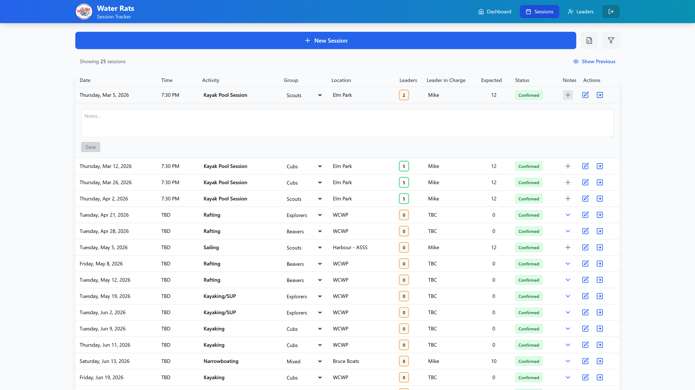 | 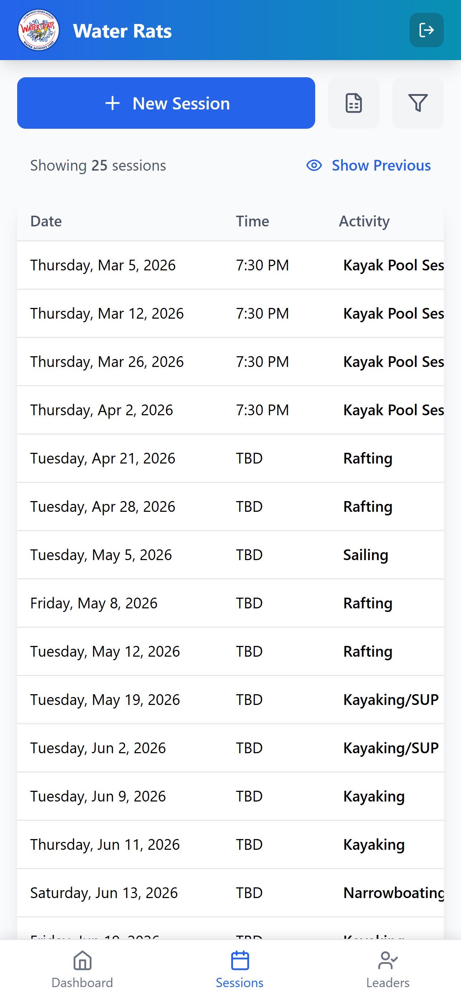 |

---

### Sessions — Calendar View

Monthly grid with colour-coded session chips: 🟡 Planning, 🟢 Confirmed, 🔵 Completed, 🔴 Cancelled. Sessions needing leaders get an orange ring. Click any chip to jump to that session's detail.

| Desktop View | Mobile View |
| :---: | :---: |
| 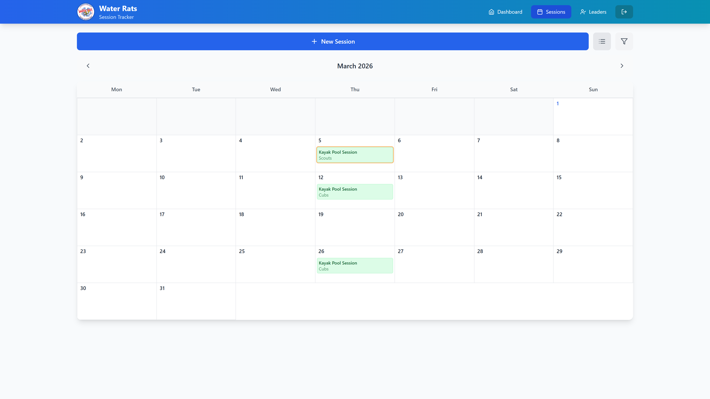 | 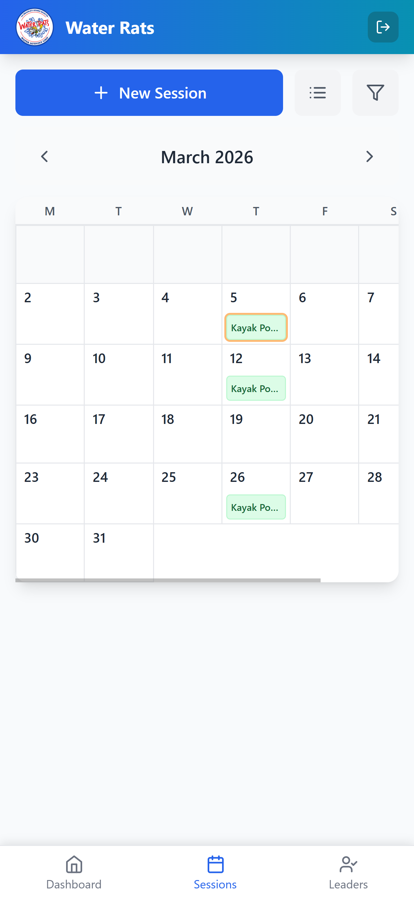 |

---

### Leaders Directory

Cards for each leader showing avatar (colour-coded initials), contact info, personal and scouting qualifications as pill badges, and their upcoming session assignments.

| Desktop View | Mobile View |
| :---: | :---: |
| 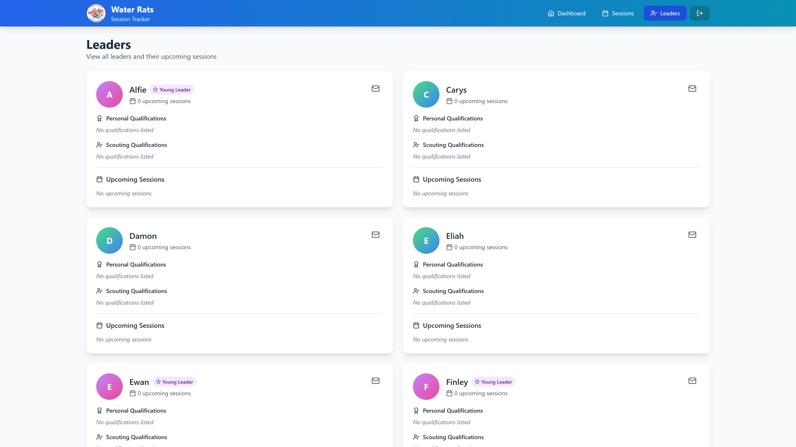 | 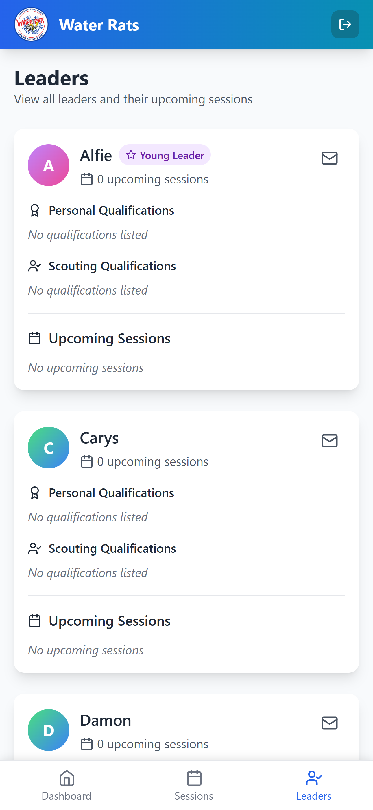 |

---

### Public Registration Form

A public-facing volunteer interest form powered by the dynamic form engine. No authentication required. Submissions are stored in Firestore.

| Desktop View | Mobile View |
| :---: | :---: |
| 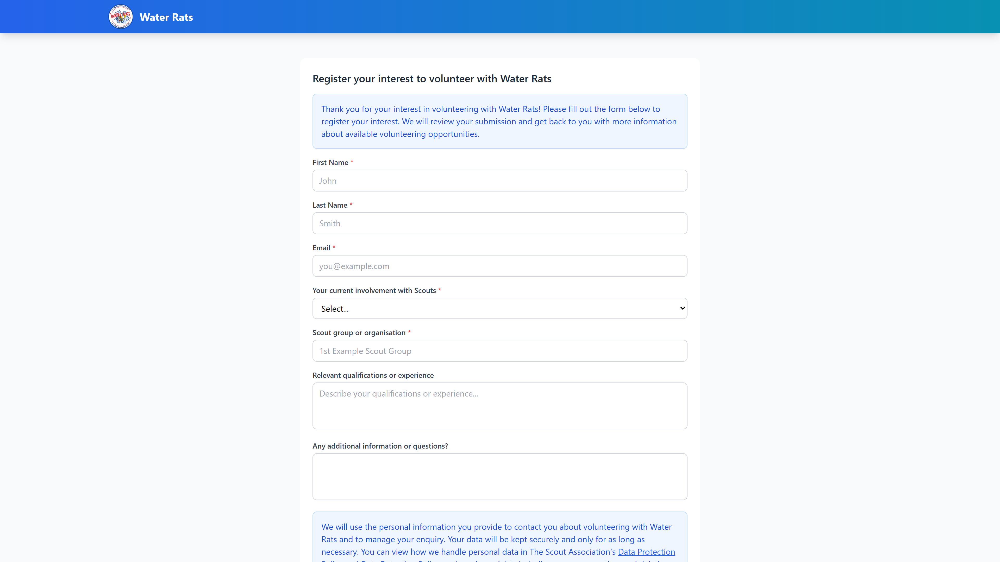 | 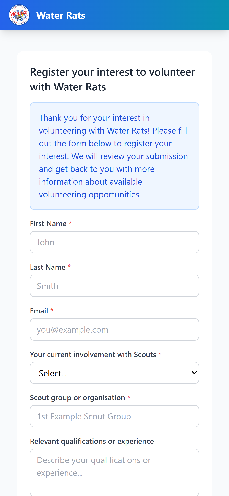 |

---

### Modals

Reusable modal system for adding, editing, and deleting sessions, signing up leaders, updating session status, and confirming discards. All modals feature overlay backdrop, click-outside-to-close, and dirty-checking to prevent accidental data loss.

| Add Session | Leader Signup |
| :---: | :---: |
| 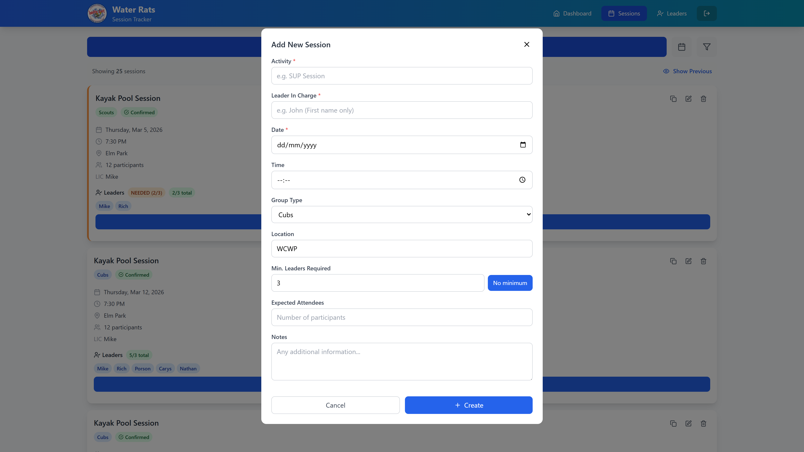 | 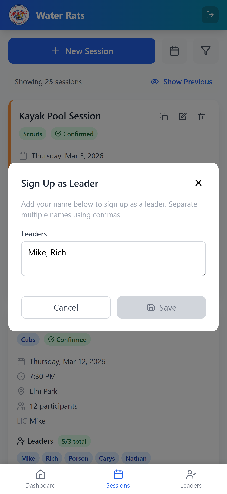 |

---

## 🏗 Architecture

```
┌─────────────────────────────────────────────────────────┐
│                        Frontend                         │
│  React 18 + TypeScript + Tailwind CSS + Vite            │
│                                                         │
│  ┌──────────┐ ┌──────────┐ ┌──────────┐ ┌────────────┐  │
│  │Dashboard │ │ Sessions │ │ Leaders  │ │Public Form │  │
│  │          │ │ 3 views  │ │Directory │ │Dynamic JSON│  │
│  └────┬─────┘ └────┬─────┘ └────┬─────┘ └─────┬──────┘  │
│       │            │            │             │         │
│  ┌────▼─────────────▼────────────▼──────────────▼─────┐ │
│  │              Utility / Service Layer               │ │
│  │     sessions.ts  │  leaders.ts  │  forms.ts        │ │
│  └────────────────────────┬───────────────────────────┘ │
└───────────────────────────┼─────────────────────────────┘
                            │
                    ┌───────▼────────┐
                    │    Firebase    │
                    │                │
                    │  ┌───────────┐ │
                    │  │ Firestore │ │  Collections: sessions, leaders,
                    │  └───────────┘ │  forms/{id}/submissions
                    │  ┌───────────┐ │
                    │  │   Auth    │ │  Custom token via Cloud Function
                    │  └───────────┘ │
                    │  ┌───────────┐ │
                    │  │ Functions │ │  loginWithPassword (validates
                    │  └───────────┘ │  shared password, issues token)
                    │  ┌───────────┐ │
                    │  │ Hosting   │ │  Static SPA hosting
                    │  └───────────┘ │
                    └────────────────┘
```

### Data Model

```typescript
Session {
  id, startTime, timeTBD, activity, groupType,
  location, leaderNames[], leaderInCharge,
  minNumberOfLeaders, maxParticipants,
  expectedAttendees, cost, status, notes, equipment[]
}

Leader {
  id, name, email, phone,
  personalQualifications[], scoutingQualifications[],
  youngLeader
}
```

---

## 🛠 Tech Stack

| Layer | Technology | Purpose |
|-------|-----------|---------|
| **UI Framework** | React 18 | Component-based UI with hooks |
| **Language** | TypeScript 5.5 | Type safety across the entire codebase |
| **Styling** | Tailwind CSS 3.4 | Utility-first responsive styling |
| **Build Tool** | Vite 5.4 | Fast HMR and optimised production builds |
| **Backend** | Firebase Firestore | NoSQL document database |
| **Auth** | Firebase Auth | Custom token authentication via Cloud Functions |
| **Serverless** | Firebase Cloud Functions | Password validation and token issuance |
| **Hosting** | Firebase Hosting | Static SPA deployment |
| **Icons** | Lucide React | Consistent, lightweight icon set |
| **Routing** | React Router 7 | Client-side SPA routing with auth guards |
| **Dates** | date-fns | Lightweight date formatting and manipulation |

---

## 🚀 Getting Started

### Prerequisites

- Node.js 18+
- Firebase CLI (`npm install -g firebase-tools`)

### Installation

```bash
# Clone the repository
git clone https://github.com/your-username/Water-Rats-Tracker.git
cd Water-Rats-Tracker

# Install dependencies
npm install

# Install Cloud Functions dependencies
cd functions && npm install && cd ..

# Start the development server
npm run dev
```

### Firebase Setup

1. Create a Firebase project at [console.firebase.google.com](https://console.firebase.google.com)
2. Enable **Firestore**, **Authentication**, and **Hosting**
3. Add your Firebase config to `src/util/config.ts`
4. Deploy Cloud Functions: `firebase deploy --only functions`
5. Deploy hosting: `firebase deploy --only hosting`

---

<p align="center">
  Built by <strong>Nathan Wong</strong>
  <br/>
  <sub>If you have questions about this project, feel free to reach out.</sub>
</p>